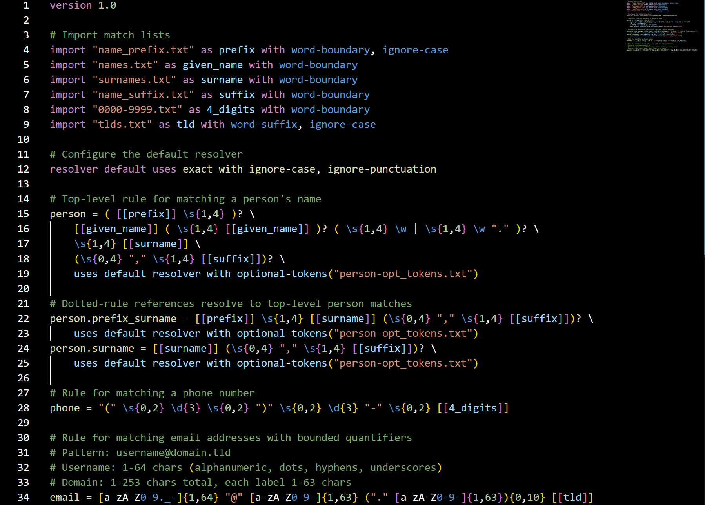

# OmegaOMG Language Support



A Visual Studio Code extension that provides syntax highlighting, completion, navigation, hover help, and validation for OmegaOMG (Object Matching Grammar) `.omg` files.


## Features

Implemented (current codebase):

- Syntax Highlighting (TextMate grammar `syntaxes/omg.tmLanguage.json`)
- AST-backed Parser (custom lightweight parser inspired by a Lark grammar design)
- Real-time Diagnostics:
   - Syntax errors from the parser
   - Undefined rule references
   - Disallowed/unbounded quantifiers (`+`, `*`, `{n,}`) flagged
   - Missing import file / optional-tokens file existence checks
- Intelligent Completion (context + general):
   - Import flags: `word-boundary`, `word-prefix`, `word-suffix`, `ignore-case`, `ignore-punctuation`, `elide-whitespace`, `line-start`, `line-end`
   - Keywords: `version`, `import`, `as`, `with`, `resolver`, `default`, `uses`
   - Escape sequences: `\\d`, `\\D`, `\\s`, `\\S`, `\\w`, `\\W`, `\\b`, `\\B`
   - Resolver methods: `exact`, `fuzzy`, `phonetic`, `semantic`, `regex`, `custom`
   - Rule name references (from parsed definitions)
   - Imported list aliases
   - Quantifier helpers (`?`, `{n}`, `{n,m}`)
- Hover Information (dual AST + regex fallback) for:
   - Keywords, import flags, resolver flags & methods
   - Named captures, list matches `[[name]]`, filters, character classes, escapes, quantifiers, anchors
   - String literals with file existence status in context
- Navigation (single-file scope):
   - Go to Definition (rule definitions)
   - Find All References (rule / identifier occurrences in same document)
- File Reference Validation:
   - `import "file" as alias` path existence
   - `optional-tokens("file1", "file2")` existence

Not yet implemented (future work opportunities):

- Cross-file navigation / multi-file reference resolution
- Pattern snippet contributions (no snippets are contributed presently)
- Configuration settings (`contributes.configuration`) for enabling/disabling specific validations
- Marketplace publishing automation docs / CI workflow docs

## Language Elements Supported

- Version declarations (`version 1.0`)
- Import statements with optional flags (`import "file.txt" as alias with ignore-case, word-prefix`)
- Rule definitions (`rule_name = pattern` with optional trailing `uses ...` clause)
- Resolver default: `resolver default uses exact` (plus flags via `with` inside rule-level uses)
- Pattern expressions: alternation (`|`), concatenation, grouping `(...)`
- Quantifiers: `?`, `{n}`, `{n,m}` (bounded only)
- List matches: `[[list_name]]` with optional filter `[[list_name:filter("arg")]]`
- Named captures: `(?P<name>...)`
- Character classes `[a-zA-Z0-9]` with ranges & escapes
- Anchors: `^`, `$`
- Escape sequences: `\d`, `\D`, `\s`, `\S`, `\w`, `\W`, `\b`, `\B`

## Requirements

- Visual Studio Code 1.100.0 or higher

## Installation (Local Dev)

1. Clone the repository
2. Open folder in VS Code
3. Run `npm install`
4. Press `F5` (debug) to launch an Extension Development Host
5. Open a `.omg` file

## Quick Start for Developers

**Build & install locally:**
```
npm install
npm run build            # compile + package (.vsix)
npm run install-local    # install generated VSIX into your VS Code
```

**Example files (open to test):** `examples/sample.omg`, `examples/completion-test.omg`, `examples/test.omg`

**Development workflow:**
```
npm run watch            # incremental rebuilds
npm run compile          # one-off compile (webpack)
npm run clean            # remove build output
npm run release          # clean + build + reminder for publish
```

All build operations use npm scripts for cross-platform compatibility.

## Usage

Create a `.omg` file and start writing patterns. Completions & hovers appear automatically. See the `examples/` directory for concise samples.

### Code Completion Triggers

1. Import flags: after `with ` in an import
2. Keywords: anywhere (parser-driven context helps relevance)
3. Escape sequences: type `\` then request suggestions
4. Rule references: inside expressions suggestions include existing rule names
5. List aliases: inside `[[ ]]` contexts (type `[[` then request suggestions)

Example (see [`examples/sample.omg`](examples/sample.omg) for more):
```omg
version 1.0

import "names.txt" as names with word-prefix, word-suffix
import "locations.txt" as places with word-boundary

person_pattern = [[names]] " lives in " [[places]]
```

Additional trigger characters registered: `. " [ ( { \\`

## Developer Instructions

> **Cross-Platform Development**: All command-line instructions work in any terminal environment. On Windows, you can use PowerShell, Command Prompt, Git Bash, or WSL. The npm commands are consistent across all platforms.

### Prerequisites

Install:
- Node.js (v16+)
- npm (bundled with Node.js)
- Visual Studio Code

### Setting Up the Development Environment

1. **Clone the repository:**
   ```
   git clone https://github.com/scholarsmate/omega-omg-vscode
   cd omega-omg-vscode
   ```

2. **Install dependencies:**
   ```bash
   npm install
   ```

3. (Optional) Install VSCE globally if you plan to publish:
   ```
   npm install -g @vscode/vsce
   ```

### Building the Extension

#### Quick Build with npm scripts

The project includes convenient npm scripts for building:

```bash
# Compile TypeScript and build the extension
npm run compile

# Package the extension into a .vsix file
npm run vsix

# Build and package in one command
npm run build

# Clean previous builds
npm run clean
```

#### Manual (alternative) build steps

```
rimraf dist *.vsix        # or manually delete
npm run compile           # webpack build -> dist/
npm run vsix              # produce VSIX
```

### Development Workflow

1. **Make changes** to the source code (`src/extension.ts`, `syntaxes/omg.tmLanguage.json`, etc.)

2. **Test changes** by pressing `F5` to launch Extension Development Host:
   - Opens a new VS Code window with your extension loaded
   - Open a `.omg` file to test syntax highlighting and completion

3. **Use VS Code tasks** for quick building:
   - Press `Ctrl+Shift+P` → "Tasks: Run Task" → "Build OMG Extension"
   - Or use the keyboard shortcut `Ctrl+Shift+B`

4. **Available npm scripts:** (see `package.json` for complete list)
   ```
   npm run compile       # webpack build
   npm run watch         # webpack --watch
   npm run build         # compile + vsix
   npm run vsix          # package only
   npm run test          # run tests (vscode-test)
   npm run lint          # eslint src
   npm run clean         # remove build artifacts
   npm run release       # clean + build + message
   npm run install-local # install built VSIX
   ```

5. **Version management:**
   ```bash
   npm run version:patch    # Increment patch version
   npm run version:minor    # Increment minor version
   npm run version:major    # Increment major version
   ```

6. **Publishing (manual)** – requires publisher setup:
   ```
   npm run publish:patch | publish:minor | publish:major
   ```

### Installing the Built Extension

Generated file: `omegaomg-language-support-<version>.vsix` (exact name depends on final `name` & version).

Command line:
```
code --install-extension omg-language-support-0.0.1.vsix
```

VS Code UI:
1. Extensions View (`Ctrl+Shift+X`)
2. Ellipsis menu → Install from VSIX…
3. Select the `.vsix`

### Versioning & Publishing Summary

Scripts provided:
```
npm run version:patch | version:minor | version:major  # bump w/out git tag
npm run publish:patch | publish:minor | publish:major  # bump + test + package + publish
npm run publish                                      # publish current version
```

First-time publish: create a publisher, get a token, `vsce login <publisher>` then run a publish script.

### CI / Automation

No CI workflows are included in this repository yet. (Future enhancement: add GitHub Actions for test + package + publish on tagged releases.)

### Project Structure

```
omega-omg-vscode/
├── src/
│   ├── extension.ts              # Activation & provider registration
│   ├── omg-language-service.ts   # Parser-driven language features
│   ├── omg-parser.ts             # Custom parser building AST
│   ├── omg-constants.ts          # Keywords, flags, docs
│   └── test/extension.test.ts    # Basic tests
├── examples/                     # Sample .omg files
├── syntaxes/omg.tmLanguage.json # TextMate grammar
├── language-configuration.json   # Comments/brackets config
├── scripts/clean.js              # Clean build artifacts
├── scripts/install-local.js      # Install built vsix helper
├── scripts/version-sync.js       # Version sync utility
├── webpack.config.js             # Bundle config
├── package.json                  # Extension manifest
└── README.md
```

### Debugging the Extension

1. **Open the project** in VS Code
2. **Set breakpoints** in `src/extension.ts`
3. **Press F5** to launch Extension Development Host
4. **Open a `.omg` file** in the new window to trigger the extension
5. **Check the Debug Console** for output and errors

### Troubleshooting Build Issues

**Common Problems and Solutions:**

- **"vsce: command not found"**
  ```bash
  npm install -g @vscode/vsce
  ```

- **TypeScript compilation errors**
  ```bash
  npm run compile
  # Fix any reported errors in src/extension.ts
  ```

- **Missing dependencies**
  ```bash
  rm -rf node_modules
  npm install
  ```

- **Extension not loading in Development Host**
  - Check VS Code Developer Tools (`Help` → `Toggle Developer Tools`)
  - Look for errors in the Console tab
  - Verify `package.json` has correct `activationEvents`

- **Command not found errors**
  ```bash
  # For Node.js on Linux
  sudo apt install nodejs npm  # Ubuntu/Debian
  
  # For Node.js on macOS
  brew install node           # macOS with Homebrew
  
  # For vsce (all platforms)
  npm install -g @vscode/vsce
  ```

- **npm command failures**
  - Ensure you're in the correct directory (`cd d:\omgseek\omg_syntax`)
  - Try clearing npm cache: `npm cache clean --force`
  - Reinstall dependencies: `Remove-Item node_modules -Recurse -Force && npm install`

**Verifying the Build:** Ensure the `.vsix` includes `dist/extension.js` (webpack output), grammar + language configuration, and assets referenced in `package.json`.

### Performance Considerations

- The extension uses **webpack** for bundling to reduce file size
- **Lazy loading** is implemented for completion providers
- **Regex patterns** in the grammar are optimized for performance
- **Rule discovery** is cached to avoid repeated file parsing

## Extension Settings

No custom settings contributed yet. Standard editor settings (e.g. `editor.suggestOnTriggerCharacters`, `editor.hover.enabled`) apply globally.

## Known Issues / Limitations

- Navigation is single-file only (no cross-file rule resolution)
- No snippet contributions (despite earlier roadmap ideas)
- No configuration options (`contributes.configuration` not defined)
- No CI automation (manual publishing only)
- Activation events list is empty; consider adding `onLanguage:omg` for lazy activation

**Reporting Issues:**
If you encounter bugs or have feature requests, please file an issue with:
- VS Code version
- Extension version
- Sample `.omg` file that reproduces the issue
- Expected vs. actual behavior

## Release Notes

### 0.0.1 (Current)

**Initial Release Features:**
- ✅ Complete syntax highlighting for OMG language
- ✅ Intelligent code completion for import flags, keywords, and patterns
- ✅ Hover documentation for language elements
- ✅ Support for all OMG language constructs including `word-prefix` and `word-suffix` flags
- ✅ TextMate grammar with comprehensive pattern matching
- ✅ Language configuration for brackets, comments, and auto-closing pairs
- ✅ Build system with webpack bundling and automated packaging

**Import Flags Supported:**
- `word-boundary` - Match at word boundaries
- `word-prefix` - Match at word prefixes  
- `word-suffix` - Match at word suffixes
- `line-start` - Match starts at the start of a line
- `line-end` - Match ends at the end of a line
- `ignore-case` - Case-insensitive matching
- `ignore-punctuation` - Ignore punctuation in matches
- `elide-whitespace` - Collapse whitespace in matches

**Language Elements:**
- Version declarations (`version 1.0`)
- Import statements with multiple flag support
- Rule definitions with pattern expressions
- Resolver configurations (`resolver default uses method`)
- List matches with optional filters (`[[name:filter]]`)
- Named captures (`(?P<name>pattern)`)
- Character classes and escape sequences
- Quantifiers and grouping constructs

## File Validation

Real-time diagnostics add errors for:
- Missing import target files
- Missing `optional-tokens()` files
- Undefined rule references
- Disallowed quantifiers (`+`, `*`, `{n,}`)

Indicators:
- Red squiggles & Problems panel entries
- Hover displays ✅ exists / ⚠️ missing for referenced files

Try editing paths in `examples/sample.omg` to see validation behavior.

---

## Following extension guidelines

This extension follows the VS Code extension best practices and guidelines.

* [Extension Guidelines](https://code.visualstudio.com/api/references/extension-guidelines)

## Working with Markdown

You can author your README using Visual Studio Code. Here are some useful editor keyboard shortcuts:

* Split the editor (`Cmd+\` on macOS or `Ctrl+\` on Windows and Linux).
* Toggle preview (`Shift+Cmd+V` on macOS or `Shift+Ctrl+V` on Windows and Linux).
* Press `Ctrl+Space` (Windows, Linux, macOS) to see a list of Markdown snippets.

## For more information

* [Visual Studio Code's Markdown Support](http://code.visualstudio.com/docs/languages/markdown)
* [Markdown Syntax Reference](https://help.github.com/articles/markdown-basics/)

**Enjoy!**
